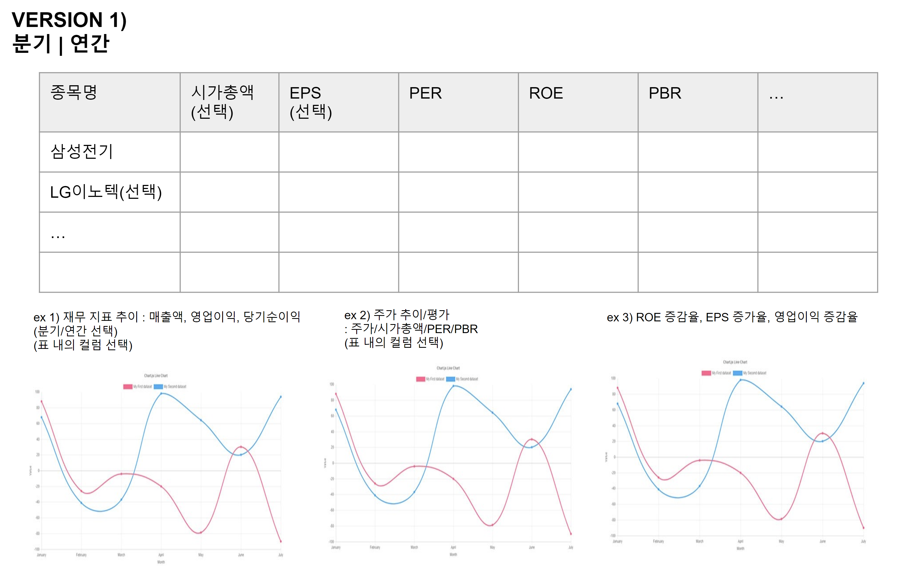

# 국장 계산기

만들다보니 생각난게 이렇다. 원래는 실적이 꾸준히 증가하는 기업인지 확인하고, 다음분기 실적이 발표됬을때 원하는 PER 인지, EPS는 증가했는지 확인해보는 용도였다. 

 

### 계획

**1차 계획** 

**`~ 2022/05/08`** 

재무데이터(매출액, 영업이익, 당기순이익), 현재주가, 가치(Valueation) 지표 크롤링 

> 표, 차트 기능 개발, 크롤링 개발, 프로젝트 기본 구조 세팅 
>
> 캐시 처리 + 크롤링 배치 처리는 다음 2차수 계획에서 
>
> 첫 화면이 보이는지 여부에 집중해서 개발.  
>
> 테이블 설계 역시 이 기간 동안은 조금 모자라더라도 단순한 구조로. 

 

주요 작업 리스트업

- 크롤링 개발
- 상장 주식 종목리스트 저장기능 개발
- 테이블 설계/API 개발
- React Data Table 세팅
- React Chart 기본 세팅 (분기/연도별 영업이익/당기순이익/매출액)

 

**`~ 2022/05/15` + 5Day**  

> 시간이 많지 않아 쉽지 않고, 체력적으로 부족한 부분이 제일 크기에, 5일 정도의 여유 기간을 두었다. 이 기간동안 사이드 프로젝트 개발만 하지는 못한다.  
>
> 이 기간 동안 아래의 일들도 해야 한다 
>
> - 이직준비, 코테 준비
> - 자바 기본 개념 리마인드(Effective Java, 자바 공부) 
> - 스프링/JPA 주요 기능 리마인드
> - TDD/스레드 프로그래밍 했을때 접했던 기본적인 내용들 정리 등
>
> 의 작업을 해야 하기에, 여유기간으로 `+5일`을 두었다. 
>
>  
>
> 그리고 충분히 지키지 못할만한 계획이기도 해서, 지키면 대박이지만, `+5일`을 여유분으로 두고 이 후에도 못지키면 `+3일`을 더 여유분으로 잡기로 했다. 
>
> `+3일` 은 마음속의 지지선이다...으.... 
>
>  

 

주요 작업 리스트업 

개별 종목 종가 데이터 & 종가 대비 PER 그래프 

- 재무데이터 테이블 구조 개선, DB 액세스 코드 개선작업
- 크롤링 개발
- 데이터 저장 기능 개발
- 종가 데이터 차트 조회 API 개발

 

2차 계획 

**`~ 2022/05/31` + `5day`** 

> 캐시 처리 
>
> 회원가입기능 개발 (기본키 기능은 임시적으로 시퀀스로 대체) 
>
> 해시코드 기능 개발&스터디 
>
> 배치 or 데이터플로우 or quertz 기반 분기/연도 실적 갱신/update  기능 개발 

 

### 페이지 기획 1) 지속성장 기업 or 성장주 찾기 

1페이지

2페이지

### 페이지 기획 2) 과대 낙폭 기업 리스트

**갑자기 생각난 아이템. 실적 과대 낙폭주 리스트** 

사람의 욕심은 끝이 없어서... 다음 분기 실적이 확 꺾인 기업을 모두 리스트업 하는 기능도 갑자기 생각이 났다. 이건 아마도 이직한다음에 구상하고 시작하지 않을까 싶다. 어떤 데이터를 쓸지도 아직 못정했다. 

예를 들면, 1년 전에 나노신소재가 그랬다. 실적이 적자가 났었는데, 이때 주가가 엄청 꺾였다. 그런데 이게 가는 주식인걸 아는 사람들은 모두 물타기를 하거나, 진바닥이 올때까지 기다리지 않았나 싶었다. 

이때 삼프로tv의 이진우 프로 아저씨도 한마디 거들었었다. `저는 실적개선 기대주를 좋아해요. 이번 학기 성적이 잠깐 떨어진 우등생은 다음분기에 회복하거든요`  

어찌보면 이번에 오스템 임플란트 같은 확실한 주식의 매수 타이밍을 재는 사람들도 이런 부류에 속하려나 싶기도 하다. 그래서 숫자로 보이는것 말고 숫자가 속이고 있는 주가 성장 확율도 리스트업하면 좋겠다 싶었다. 

 

### todo 리스트업

- 팔려고 하는 PER 에 도달했는지 검사용도
  - 목표 PER/시가총액/... etc 도달 알림 메일 발송기능
  - EPS 증감율, 영업이익 증감율 요약
- 데이터 그리드 / `Chart.js`  with react
- 관심종목 관리
- FN GUIDE, NAVER 금융 데이터 활용
  - 최근 3분기/3개연도 매출/영업이익/당기순이익 
  - 단순 PER/매출총익,영업익,당기순익 그래프 그려보기 (FN GUIDE 활용... 데이터 구할 수 있을까...)
  - ROE, EPS 최근 3개분기/연도 추이 그래프 그려보기 
  - todo 리스트는 점점 더 줄여보자. 너무 많다. 시간 없다.
- 관심 기업 재무 제표 개별 데이터 보관용도 (비공개)
- 재무제표 공부 (연습 용도)
  - 재무제표 데이터로 쌩으로 PER 계산 후 네이버/FN GUIDE 에서 안내하는 지표와 맞게 계산했는지 대조하는 테스트 코드 
    - (그냥 궁금해서 ㅋㅋㅋ)
- 해쉬코드 기반 기본키 체계 구현해보기
  - 그냥 예전부터 해보고 싶었는데, 가능할지 잘 모르겠다.
  - 테스트코드로 시작해봐야지 뭐...

 

### Tech

- 로그인 기능 (단순한 기능인데, 굳이 로그인 만들어야 하는지 검토가 좀 필요할 듯 하긴 함)
- 원하는 주식들의 리스트를 저장/조회 하는 기능
- DART API 조회 기능
- 메일 발송 기능
- TDD 

 

### 데이터 제공처

- DART - 재무제표
- fnguide - 가치지표
- naver - 현재 주가
- 종목 코드 어디서 구하더라... 이거 찾아놓자.

 

### 결정 못한 것들

- 코틀린 써볼까? 등등
- id 값 부여 방식을 단순 Long 방식 말고 hashCode를 직접 생성해서 부여해볼까? 등등
  - 그냥 시도라도 해보고 싶다? or 항상하던 방식?

