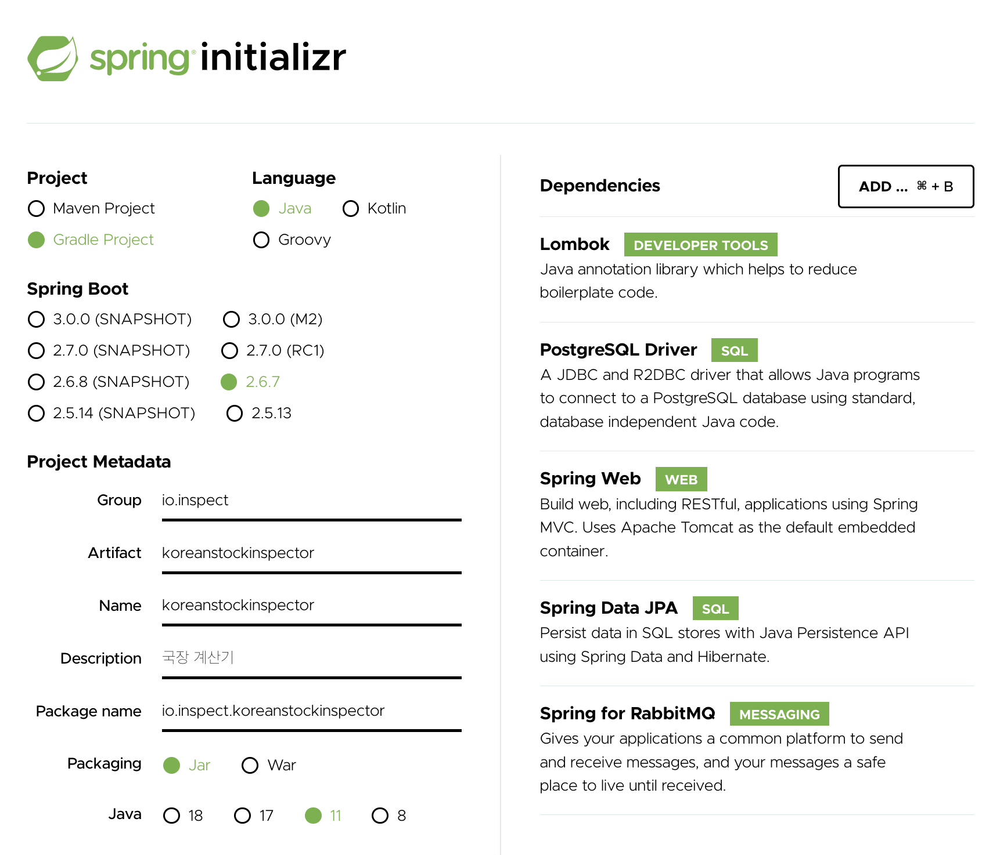

# 기술스택 정하기

## Backend

#### 2022-04-25

**언어 선택** 

초기 세팅시에 Kotlin 을 쓸지 Java 를 쓸지 고민을 좀 했다. 생각해보니 이랬다.

- 코틀린은 단순히 아직까지는 써보고 싶은 언어다.
- 자바로는 뭔가를 만들때 능수능란하게 사용할 수 있다.
- 이번 프로젝트의 목적은 TDD다.

그래서 그냥 Java 를 선택했다. Java 버전은 16을 사용하고 있는데, 패키징 기본은 11로 선택했다. 

 

**Spring 의존성 고민?** 

기술들도 뭘 쓸까 고민해봤는데, 잘 고민해보니깐, 기획상으로 결정한 내용상으로는 아래와 같다. 

나중에 security도 연동할 생각이지만, 초기단계부터 정신이 산만하면 될일도 안될 것 같아서 진짜 2주일 동안 필요한 것들만 모아봤다.

 

 

**기본키를 해시를 사용할지??** 

초반 기획시 굉장히 호기심이 갔던 내용이었다. 중간중간 업무가 조금 밀려있어서 자료 검색만 일단 해두었는데, 첫 2주 동안 기본키 값을 세팅하는 방식을 선택하지 않을까 싶다. 일단 마음은 이미 `이왕 해보는거 한번 해시기반 키를 만들어서 테이블의 기본키로 세팅해서 테스트해보려는 시도를 해보자.`로 기울어져있다. 

이렇게 하면 안되는 이유를 찾고 있기는 하다. 그 동안은 TDD 기반으로 기업정보들에 대한 크롤링 코드들을 만들어둘예정이다. 

 

**서버** 

일단은 아직까지는 개인 프로젝트로 익숙한 것은 AWS다. 그냥 계정 하나 새로 파기로 결정했다. 

 

## Frontend

리액트를 주 스택으로 정하기로 했다. 업데이트 되는 대로 계속 추가 예정. 

 

